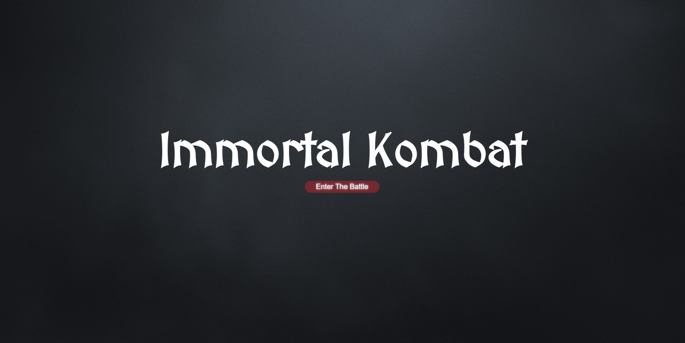
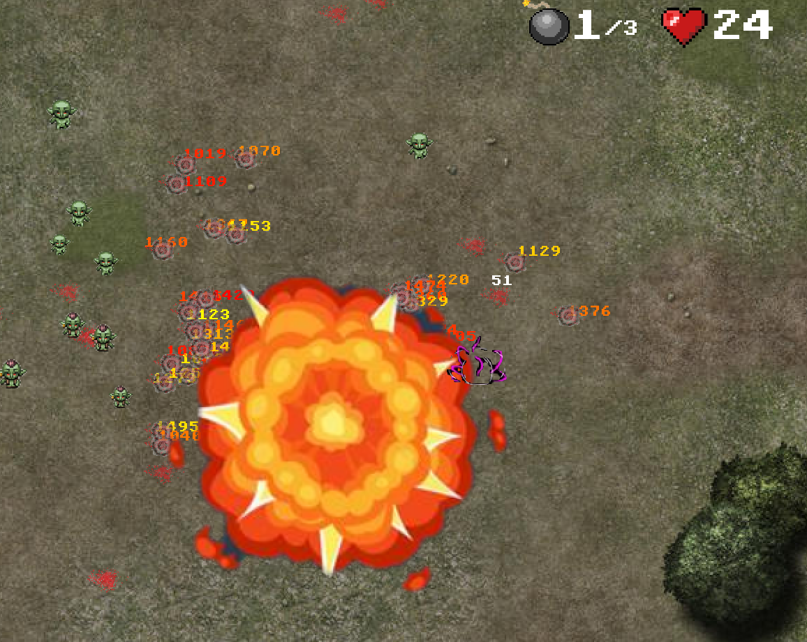
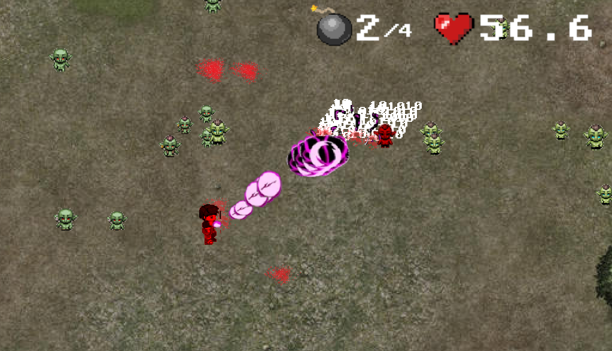
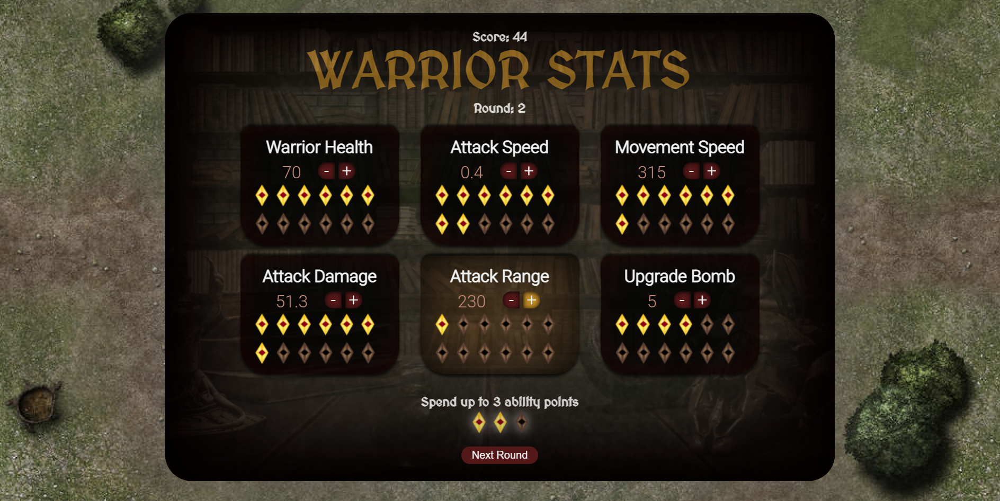

# Immortal Kombat

## Description

This is a top-down survival horde mode fighting game where you play as a warrior fighting against waves of goblins. Level up after each round and spend ability points.

## Table of Contents

[Screenshots](#screenshots)

[Installation](#installation)

[Usage](#usage)

[License](#license)

[Contribute](#contribute)

[Questions](#questions)

### Screenshots

## Installation

To play the game simply signup or login and press spacebar.

## Usage

Controlls:

Move: W,A,S,D.

Dash: Space.

Bomb: Shift.

Attack: Mouse cursor.

## License

This project is licensed under the MIT license.

## Contribute

Anyway you like.

## Questions

If you have any questions please visit my GitHub at https://github.com/Robert-Rousset or email me at robertrousset94@gmail.com.
